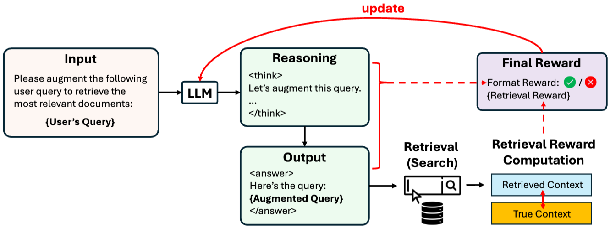

# Deep Retriever
  

강화학습(RL)을 통해 언어 모델(LLM)을 최적의 '쿼리 생성기'로 훈련시켜 정보 검색(IR) 성능을 극대화하는 것.
이 논문은 LLM(예: Qwen2.5, Llama3.2)을 쿼리 생성기로 사용하며, PPO 또는 GRPO 알고리즘을 통해 모델의 정책(π)을 직접 업데이트합니다. A1 전략의 핵심은 에이전트가 호출한 외부 도구가 내놓은 '검증 가능한 결과(Verifiable Outcomes)'를 학습 신호로 사용하는 것.

$$
r(q, q') = r_{\text{retrieval}}(q, q') + r_{\text{format}}(q')
$$
- q: 사용자의 원래 쿼리 (Initial Query)
- q: 모델이 생성한 확장/재작성된 쿼리 (Augmented Query)
- r: 작업별 검색 성능 측정값
- r_format: 출력 구조(형식) 준수 여부에 따른 보상

문헌 검색 (Literature Search): Recall@K (상위 K개 결과 중 정답 문헌의 포함 비율), 증거 탐색 검색 (Evidence-Seeking): 정답 스팬이 발견된 순위 (Rank of answer span hit), 전통적 IR 벤치마크: NDCG@K (관련 문서의 순위 가중치를 고려한 품질 지표),SQL 데이터베이스 검색: 실행 정확도 (Execution Accuracy)

등의 도구를 이용해서 얻은 보상을 바탕으로 에이전트를 학습시킵니다.

$$
\hat{\pi} = \arg \max_{\pi} \mathbb{E}_{q \sim \rho, q' \sim \pi(\cdot|q)} \left[ r(q, q') - \beta \log \frac{\pi(q' | q)}{\pi_{\text{ref}}(q' | q)} \right]
$$
이 수식은 도구의 성과를 보상으로 치환하는 목적으로 r 값을 최대화(max)하는 방향으로 설계되어 있으므로, 모델은 도구의 성과가 좋았던 행동(q')을 더 자주 하도록 스스로를 업데이트하게 됩니다.  
(두번째 항 - KL Divergence : 현재 학습 중인 모델($\pi$)이 학습 전의 초기 모델($\pi_{\text{ref}}$)과 너무 멀어지지 않도록 제동을 거는 장치입니다.)

즉 DeepRetrieval은 생성된 쿼리가 가져온 문서의 Recall@K나 NDCG 같은 검색 지표를 보상으로 삼아 에이전트를 학습시킵니다.

## 결론
검색 도구 결과의 수치적 지표(Metric)를 보상으로 사용하므로, 에이전트의 행동이 성공적이었는지 객관적으로 검증할 수 있는 신호를 제공하고 이 신호를 바탕으로 에이전트를 학습시키므로 A1 예시에 적절합니다.
