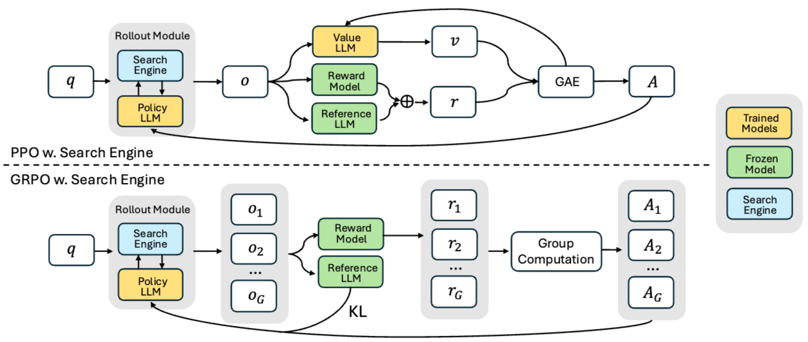

# Deepseek-R1
DeepSeek-R1은 에이전트가 내놓은 최종 출력값(Agent Output)을 학습의 핵심 신호로 사용하기 때문에 A2(Agent Output Signaled Agent Adaptation) 프레임워크의 대표적인 모델로 분류됩니다.

## 특징
- 최종 예측의 정확성: DeepSeek-R1-Zero의 보상 신호는 "추론 과정 자체에 제약을 두지 않고, 오직 그라운드 트루스(정답)에 대한 최종 예측의 정확성"에만 전적으로 기초합니다.
- 결과 기반 보상(Accuracy Rewards): 수학 문제와 같이 답이 결정된 과업에서 모델이 정해진 형식 안에 최종 답안을 제시하면, 이를 검증하여 보상을 줍니다. 이는 도구의 동작이 아닌 에이전트의 '출력(Output)'이 신호가 되는 전형적인 A2 방식입니다.
- 형식 준수 보상(Format Rewards): DeepSeek-R1은 최종 답변뿐만 아니라 출력의 구조에 대해서도 보상을 설정합니다. 모델이 사고 과정은 <think> 태그에, 최종 답변은 <answer> 태그에 넣도록 유도하며, 이 형식을 잘 지켰는지(에이전트 출력의 형태)를 평가하여 보상을 줍니다.

# Search-R1
Search-R1은 복잡한 중간 보상 대신 "최종 결과 보상(Outcome-based Reward)"만을 사용합니다.
  
검색 엔진이 가져온 문서가 얼마나 좋았는지(Recall 등)를 따지는 것이 아니라, 검색 결과를 활용해 에이전트가 내뱉은 **최종 답변의 정확도(EM)**를 학습 신호로 사용하기 때문에 A2로 평가합니다.

$$
r_{\phi}(x, y) = \operatorname{EM}(a_{\text{pred}}, a_{\text{gold}}),
$$
 - EM: 모델이 내놓은 답변이 실제 정답(Ground Truth)과 문자열 수준에서 정확히 일치하는지를 측정하는 평가 지표이자 보상 함수.
