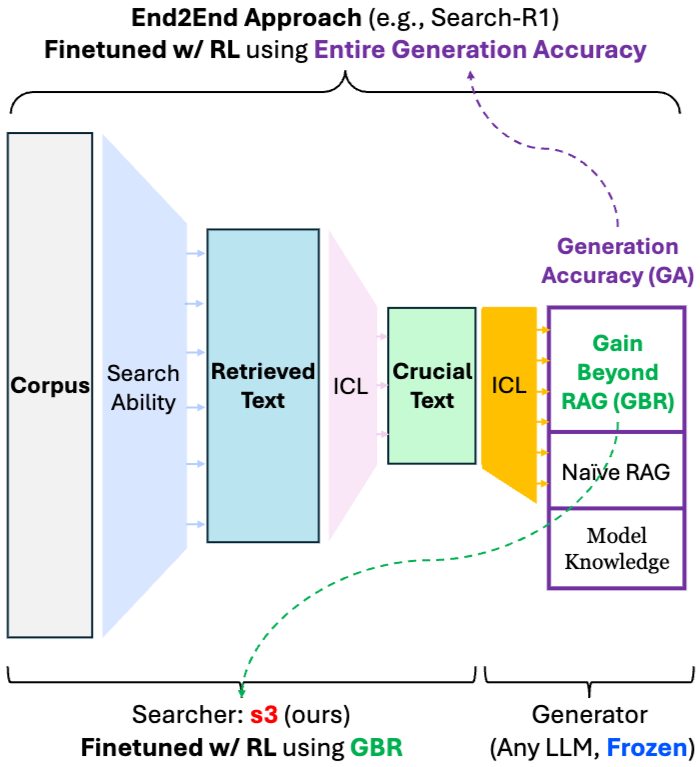
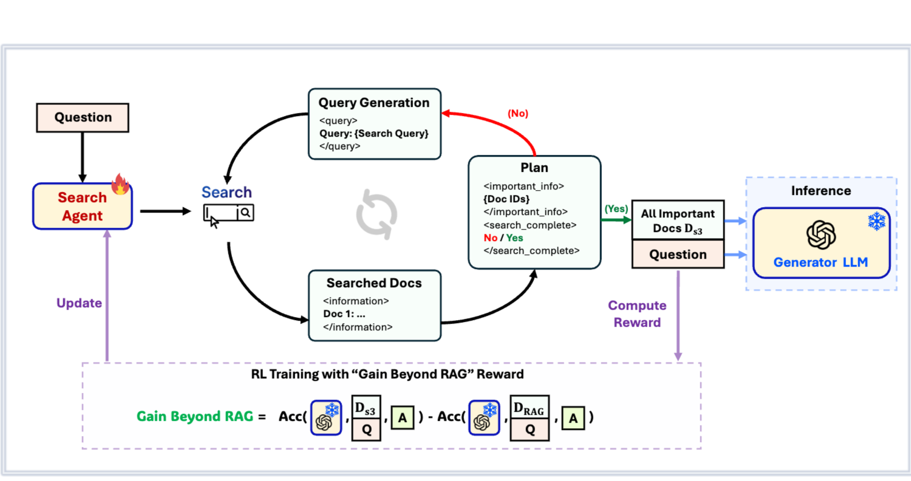

# S3(Search-Select-Serve) 
s3(Search-Select-Serve) 논문의 핵심 목적은 생성 모델(Generator)과 검색 모델(Searcher)을 분리(Decouple)하여, 매우 적은 데이터로도 효율적인 검색 에이전트를 학습시키는 것입니다.
s3는 지식을 생성하는 '생성기(Generator LLM)'를 동결(Frozen) 상태로 두고, 오직 쿼리를 생성하고 문서를 선택하는 '검색기(Searcher tool)' 모델만 강화학습으로 미세 조정합니다. 이를 통해 수십억 개의 파라미터를 가진 거대 모델(에이전트)을 매번 다시 학습시키는 비용을 피하고, 상대적으로 작은 검색용 서브모델만 에이전트에 맞춰 최적화하는 T2의 경제적 이점을 잘 보여줍니다.

  

생성기(Generator)는 'Frozen(고정)' 상태입니다. 오직 검색기(Searcher)만 강화학습(RL)으로 업데이트됩니다.  
GBR 보상의 시각화: s3는 '기본 RAG(Naive RAG)' 성능을 베이스라인으로 삼고, 검색 에이전트가 추가로 가져온 정보 덕분에 정확도가 얼마나 '상승'했는지(Gain Beyond RAG)만을 측정하여 보상으로 줍니다.
$$
\begin{align*}
\mathbf{GBR}(Q) &= \operatorname{Acc}(\mathcal{G}(Q, \mathcal{D}_{s3}), A) \\
& \quad - \operatorname{Acc}(\mathcal{G}(Q, \mathcal{D}_{\text{RAG}}), A)
\end{align*}
$$
- Exact Match(EM) 점수가 지나치게 엄격하여, 의미는 맞지만 표현이 조금만 달라도 0점을 주는 문제를 해결하기 위해 이 지표를 개발. 정규화된 실제 정답이 모델 답변 내에 하나의 단어 뭉치(token span)로 포함되어 있는지 확인합니다. 포함되어 있다면 즉시 1점을 부여하고 종료합니다. 0점일 경우 LLM 판정 (Judge Check)을 통해 고정된 외부 LLM(판정 모델)에게 답변의 의미를 다시 묻습니다.

  

1. Search Agent: 질문(Q)을 받으면 검색 쿼리를 생성합니다.
2. Iterative Process: 검색 엔진에서 문서를 가져오고(<information>), 그중 중요한 문서만 선택하며(<important_info>), 검색을 더 할지 끝낼지 스스로 결정합니다.
3. Final Serving: 최종적으로 선택된 핵심 문서들(Ds3)만 고정된 생성기(Generator LLM)에 전달하여 최종 답변(A^)을 얻습니다.

즉, 검색 에이전트가 찾은 문서(Ds3)를 썼을 때의 정확도와, 단순히 질문 키워드로 검색한 기본 문서(RAG)를 썼을 때의 정확도를 GBR을 이용해 비교한 이후, 검색 에이전트(Search Agent)에게만 전달되어 검색 전략(쿼리 생성, 문서 선택 능력)을 업데이트합니다. = T2