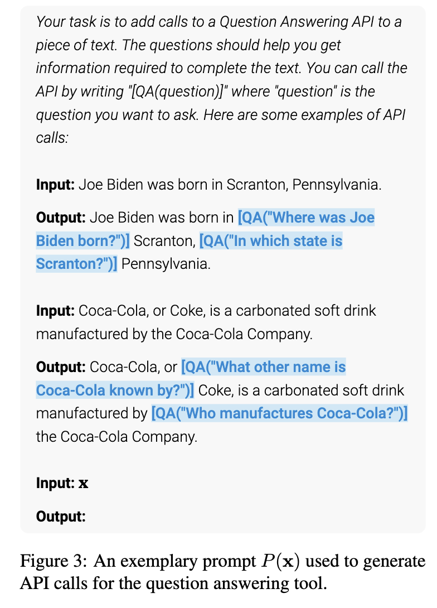

# Toolformer

  

Toolformer는 도구 실행 결과가 미래 토큰 예측의 정확도를 높여주는지를 측정하여 학습 신호로 삼는 초기 A1 방식의 대표 사례입니다. 언어 모델 M이 API 호출을 통해 외부 도구를 사용하는 법을 스스로 익히게 하는 것입니다. 모든 API의 입력과 출력은 텍스트 시퀀스로 표현되며, 특별한 토큰(예: [, ], ->)을 사용하여 텍스트 흐름 사이에 자연스럽게 삽입됩니다.

## 단계 1: API 호출 샘플링 (Sampling API Calls)
각 도구에 대해 모델이 API 호출을 삽입하도록 유도하는 소수의 예시(Demonstrations)가 포함된 프롬프트 P(x)를 작성합니다. 그리고 선정된 위치에서 최대 m개의 API 호출 후보를 샘플링한 후 실행된 결과값 단일 시퀀스 r를 얻습니다.

## 단계 2: API 호출 필터링 (Filtering API Calls) — A1 전략의 핵심
###  손실 비교

API 호출 결과(r)를 포함했을 때의 손실값(L)과 포함하지 않았을 때(또는 입력만 있고 결과가 없을 때)의 손실값(L-) 을 비교합니다. 손실값은 크로스 엔트로피(Cross-Entropy) 손실 함수의 변형입니다.

$$
L_i^{+} = L_i\bigl(e(c_i, r_i)\bigr)
= - \sum_{j=i}^{n} w_{j-i} \cdot \log p_M\!\left(x_j \mid e(c_i, r_i), x_1, \ldots, x_{j-1}\right)
$$
- $e(c_i, r_i)$ 는 API 호출 문구(c_i)와 실제 실행 결과(r_i)를 결합하여 선형화한 텍스트 

### 필터링 기준
즉, 도구 결과가 들어갔을 때의 당혹도(Perplexity)가 임계값($\tau_f$) 이상으로 크게 감소하는 경우에만 해당 호출을 '유용한 것'으로 간주하고 유지합니다.
$$
L_i^{-} - L_i^{+} \ge \tau_f
$$

## 결론
도구의 실행결과를 활용하는 손실함수가 툴이 아닌 에이전트의 파라미터를 업데이트하는 파인튜닝에 사용되기 때문에 A1의 예시로 소개되었습니다.
