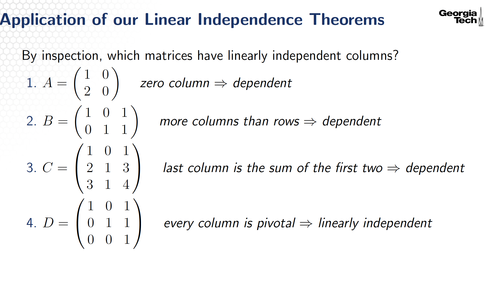

# Solution Sets and Linear Independence
## Topic 1: The Matrix Equation
### The Matrix-Vector Product
#### Notation
- $\subset$: belongs to
- $\mathbb{R}^n$: the set of vectors with $n$ real-valued elements
- $\mathbb{R}^{m \times n}$: the set of real-valued matrices with $m$ rows and $n$ columns

#### Matrix Product
$$
A\vec{x}
=
\begin{pmatrix}
\mid & \mid &        & \mid \\
\vec{a}_1 & \vec{a}_2 & \cdots & \vec{a}_n \\
\mid & \mid &        & \mid
\end{pmatrix}
\begin{pmatrix}
x_1 \\
x_2 \\
\vdots \\
x_n
\end{pmatrix}
=
x_1\vec{a}_1 + x_2\vec{a}_2 + \cdots + x_n\vec{a}_n
$$
The matrix vector product $A\vec{x}$ is a linear combination of the columns of $A$. Note that $A\vec{x}$ is in the span of the columns of $A$.

### Existence of Solutions
Since $A\vec{x}=\vec{b}$ is a linear combination of the column $A$, the equation $A\vec{x}=\vec{b}$ has a solution if and only if $\vec{b}$ is a linear combination of the columns of $A$.

#### Multiple Representations of Linear Systems
We have four equivalent ways of representing a linear system.
1. A list of equations
$$2x_1 + 3x_2 = 7, \quad x_1 - x_2 = 5$$
2. An augmented matrix
$$
\begin{pmatrix} 2 & 3 & \mid & 7 \\
1 & -1 & \mid & 5
\end{pmatrix}
$$
3. A vector equation 
$$
x_1
\begin{pmatrix}
2 \\
1
\end{pmatrix}
+
x_2
\begin{pmatrix}
3 \\
-1
\end{pmatrix}
=
\begin{pmatrix}
7 \\
5
\end{pmatrix}
$$
4. A matrix equation
$$
\begin{pmatrix}
2 & 3 \\
1 & -1
\end{pmatrix}
\begin{pmatrix}
x_1 \\
x_2
\end{pmatrix}
=
\begin{pmatrix}
7 \\
5
\end{pmatrix}
$$

## Topic 2: Solution Sets of Linear Systems
### Homogeneous Systems
- Linear systems of the form $A\vec{x} = 0$  are homogeneous.
- Linear systems of the form $A\vec{x} \neq 0$ are inhomogeneous.

Homogeneous systems always have the trivial solution(간단한, 자명한 답), $0$.
If $A\vec{x} = 0$ has a non trivial solution, there is a free variable and it means $A$ has a column with no pivot.

### Parametric Vector Form
$$
x_1 + 2x_2 = 0 \\[5pt]
\vec{x} = x_2 \vec{v}, \quad \text{where} \quad \vec{v} =
\begin{pmatrix}
-2 \\
1
\end{pmatrix}
$$
The solution set consists of all scalar multiples of a single vector and parametric vector form expresses the solution set in terms of a combination of a particular solution vector and free variables multiplied by direction vectors.  
Procedure for obtaining parametric vector form is described as follows. 
1. Reduce system to RREF.
2. Express basic variables in terms of free variables.
3. Substitute expressions into $\vec{x}$.
4. Express solution vector $\vec{x}$ in terms of a set of vectors and parameters.

#### Parametic Vector From in General Homogeneous case
In general, suppose the free variables for $A\vec{x} = 0$ are $x_k, \cdots, x_n$.  
Then all solutions to $A\vec{x} = 0$ can be written as
$$
\vec{x} = x_k \vec{v}_k + x_{k+1} \vec{v}_{k+1} + \cdots + x_n \vec{v}_n
$$
for some $v_k, \cdots, v_n$. This is parametric form of the solution. Note that the solution set is a set of points that includes the origin.

#### Parametic Vector From in General Inhomogeneous case
Suppose $A\vec{x} = b$ is consistent, and $vec{x} = \vec{p}$ is a solution. Then the solution set of$A\vec{x} = b$ is the set of all vectors of the form as follow.
$$\vec{x} = \vec{p} + \vec{x_h}$$
Where $\vec{p}$ is any particular solution, and $\vec{x_h}$$ is the set of all solutions of $A\vec{x} = 0$. Note that it only applies to consistent systems and the solution set is a line that does not pass through the origin. It can be interpreted as a shifted version of the solutions to $A\vec{x} = 0$.

## Topic 3: Linear Independence
### Linear Independence
A set of vectors $\{\vec{v_1}, \cdots, \vec{v_k}\}$ in $\mathbb{R^n}$ are linearly independent if following equation has only the trivial solution.
$$x_1 \vec{v_1} + x_2 \vec{v_2} + \cdots + c_k \vec{v_k} = 0 $$
Otherwise, it is linearly dependent. In other words, $\{\vec{v_1}, \cdots, \vec{v_k}\}$ are linearly dependent if there are real numbers $x_1, x_2, \cdots, x_k$ not all zero.

- Linear independence: there is NO non-zero solution $\vec{x}$. In other words, $\vec{x}$ has to be 0.
- Linear dependence: there is a non-zero solution $\vec{x}$. In other words, $\vec{x}$. doesn't have to be 0.

For example, consider what value $h$ has to be if the set of vectors are linearly independent.
$$
\begin{pmatrix}
1 \\
1 \\
h
\end{pmatrix},\quad
\begin{pmatrix}
1 \\
h \\
1
\end{pmatrix},\quad
\begin{pmatrix}
h \\
1 \\
1
\end{pmatrix}
$$
Let's solve using augmented matrix below.
$$
\left[
\begin{array}{ccc|c}
1 & 1 & h & 0 \\
1 & h & 1 & 0 \\
h & 1 & 1 & 0
\end{array}
\right] \rightarrow 
\left[
\begin{array}{ccc|c}
1 & 1 & h & 0 \\
0 & h-1 & 1-h & 0 \\
0 & 0 & 2 - h - h^2 & 0
\end{array}
\right]
$$
From the augmented matrix, if $(2 - h - h^2 = 0)$, vectors are dependent because $x_3$ becomes free variable.  
$$
\quad
x_1
\begin{pmatrix}
1 \\ 0 \\ 0
\end{pmatrix}
+
x_2
\begin{pmatrix}
1 \\ h-1 \\ 0
\end{pmatrix}
+
x_3
\begin{pmatrix}
h \\ 1-h \\ 2-h-h^2
\end{pmatrix}
=
\begin{pmatrix}
0 \\ 0 \\ 0
\end{pmatrix}
$$
Therefore, for vectors to be independent, $h \neq -2, h \neq -1$, otherwise $x_3$ is free and vectors are dependent.

#### Dependent Vectors
Two vectors in $\mathbb{R^n}$ are dependent when either or both of the following
occur.
- One or both vectors are the zero vector.
- One vector is a multiple of the other.

### Linear Independence Theorems
#### 1. More vectors than elements
Suppose $\vec{v_1}, \cdots , \vec{v_k}$ are vectors in $\mathbb{R^n}$ . If
$k > n$, then $\{\vec{v_1}, \vec{v_2}, \cdots, \vec{v_k}\}$ is linearly dependent. This is because if matrix has more columns than rows, so every column cannot be pivotal.  
column마다 pivot 있다 = free variable 없다 = null space trivial = 선형독립

#### 2. Set Contains Zero Vector
If any one or more of $\vec{v_1}, \cdots, \vec{v_k}$ is $\vec{0}$, then $\vec{v1}, \cdots , \vec{v_k}$ are linearly dependent. This is because if matrix has a zero column, every column cannot be pivotal.

#### Application of Linear Independence Theorems
    
