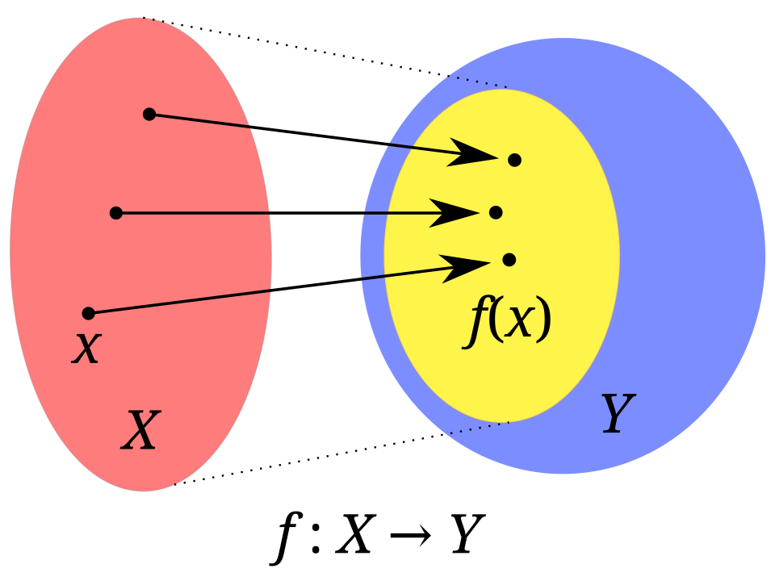
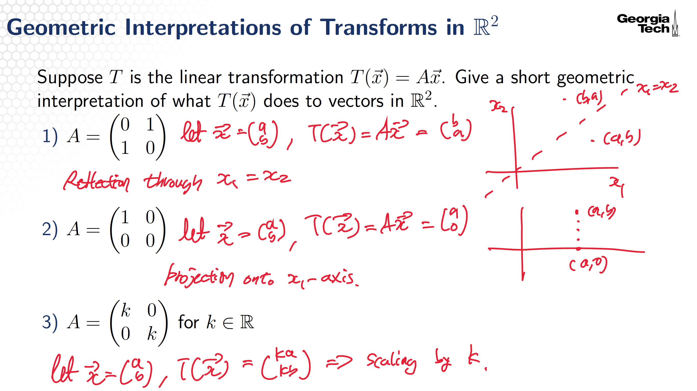
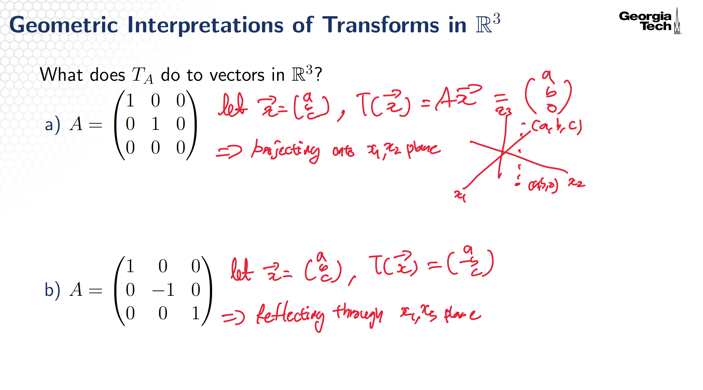

# Linear Transforms
## Topic 1: An Introduction to Linear Transforms, Incomplete
### Domain, Codomain, Range
    

- Domain: A domain of a function is the set of inputs accepted by the function.
- Codomain: A set into which all of the outputs of the function are constrained to fall.
- Image: An image is a relation between inputs and outputs. (함수에 대한 정의역의 원소(들)에 대응하는 공역의 원소(들))
- Range: The range of a function may refer either to the codomain of the function, or the image of the function.
When $T(\vec{x}) = A \vec{x}$, range is span of columns of the matrix.

### Matrix $\times$ Vectors
A linear combination of the columns of the matrix weighted by the elements of the vectors.

### Linear Transforms (principle of superposition)
If a function is "linear", it satisfies the superposition principle. Superposition can be defined by two simpler properties additivity and homogeneity for scalar.

$$
T(\mathbf{u} + \mathbf{v}) = T(\mathbf{u}) + T(\mathbf{v})
\quad \text{for all } \mathbf{u}, \mathbf{v} \in \mathbb{R}^n \\[5pt]
T(c\mathbf{v}) = c\,T(\mathbf{v})
\quad \text{for all } \mathbf{v} \in \mathbb{R}^n,\; c \in \mathbb{R}
$$
Therefore, if $T$ is linear, 
$$
T\!\left(c_1 \mathbf{v}_1 + \cdots + c_k \mathbf{v}_k\right)
=
c_1 T(\mathbf{v}_1) + \cdots + c_k T(\mathbf{v}_k)
$$

Note that every matrix transformation $T(\vec{x}) = A \vec{x}$ is linear.

### Geometric Interpretations of Transforms
    

    

## Topic 2: Linear Transforms
### The Standard Vectors
### Standard Matrix
#### Standard Matrices of Linear Transforms
### Onto and One-to-One

