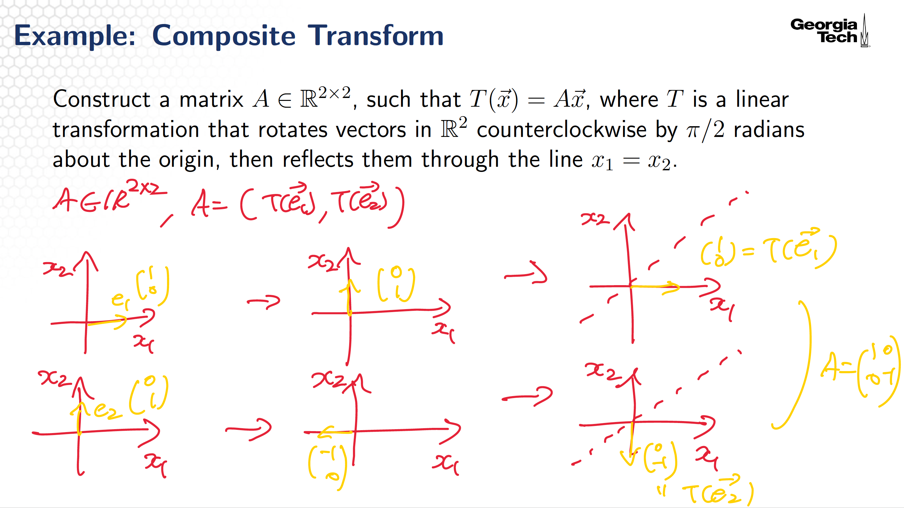
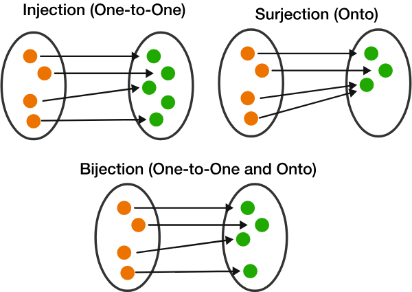

# Linear Transforms
## Topic 1: An Introduction to Linear Transforms, Incomplete
### Domain, Codomain, Range
    

- Domain: A domain of a function is the set of inputs accepted by the function.
- Codomain: A set into which all of the outputs of the function are constrained to fall.
- Image: An image is a relation between inputs and outputs. (함수에 대한 정의역의 원소(들)에 대응하는 공역의 원소(들))
- Range: The range of a function may refer either to the codomain of the function, or the image of the function.
When $T(\vec{x}) = A \vec{x}$, range is span of columns of the matrix.

### Matrix $\times$ Vectors
A linear combination of the columns of the matrix weighted by the elements of the vectors.

### Linear Transforms (principle of superposition)
If a function is "linear", it satisfies the superposition principle. Superposition can be defined by two simpler properties additivity and homogeneity for scalar.

$$
T(\mathbf{u} + \mathbf{v}) = T(\mathbf{u}) + T(\mathbf{v})
\quad \text{for all } \mathbf{u}, \mathbf{v} \in \mathbb{R}^n \\[5pt]
T(c\mathbf{v}) = c\,T(\mathbf{v})
\quad \text{for all } \mathbf{v} \in \mathbb{R}^n,\; c \in \mathbb{R}
$$
Therefore, if $T$ is linear, 
$$
T\!\left(c_1 \mathbf{v}_1 + \cdots + c_k \mathbf{v}_k\right)
=
c_1 T(\mathbf{v}_1) + \cdots + c_k T(\mathbf{v}_k)
$$

Note that every matrix transformation $T(\vec{x}) = A \vec{x}$ is linear.

### Geometric Interpretations of Transforms
    

    

## Topic 2: Linear Transforms
### The Standard Vectors
A standard vector, $\vec{e_i}$ is a vector in $\mathbb{R^n}$, in which every entry of the vector is zero, except for entry $i$, which is equal to 1. For example, 
$$
\vec{e}_1 =
\begin{pmatrix}
1 \\
0 \\
0
\end{pmatrix}, \quad
\vec{e}_2 =
\begin{pmatrix}
0 \\
1 \\
0
\end{pmatrix}, \quad
\vec{e}_3 =
\begin{pmatrix}
0 \\
0 \\
1
\end{pmatrix}
$$

Multiplying a matrix by standard vector $\vec{e_i}$ gives column $i$ of matrix $A$. For example, multiplying the matrix by $\vec{e_2}$ gave us the second column of the matrix.

### Standard Matrix
Using the concept of standard vector to construct the standard matrix of a transform.  
Let $T(x) = A \vec{x}$, a linear transformation that maps $\mathbb{R^n}$ to $\mathbb{R^m}$. Standard Matrix can be represented as follows.
$$
A =
\begin{pmatrix}
T(\vec{e}_1) & T(\vec{e}_2) & \cdots & T(\vec{e}_n)
\end{pmatrix}
$$ 

#### Standard Matrices of Linear Transforms
Reflection, Contractions and Expansions, Sheers, Projection.

##### Composite Transform Example
    

### Onto and One-to-One
    

#### Onto
A transformation $T: \mathbb{R^n} \rightarrow \mathbb{R^m} $ is onto if, for every vector $b \in \mathbb{R^m}$, the equation $T(x) = A \vec{x}$ has "at least" one solution $x \in \mathbb{R^n}$.

$T$ is onto if and only if its standard matrix has a pivot in every row.

#### One-to-One
A transformation $T: \mathbb{R^n} \rightarrow \mathbb{R^m} $ is one-to-one if, for every vector $b \in \mathbb{R^m}$, the equation $T(x) = A \vec{x}$ has "at most" one solution $x \in \mathbb{R^n}$.

$T$ is one-to-one if and only if every column of A is pivotal.

#### Properties of Onto and One-to-One
Matrix에서 행(row)은 출력 공간의 좌표 방향 이고, Column은 입력 공간의 좌표 방향이다. onto는 출력 공간이 충분히 다 만들어지는지 one-to-one은 입력 정보가 안 사라지는지 보는 개념이다.

onto는 “출력” 기준 $Ax=b$ 가 모든 $b$ 에 대해 가능해야 하므로
출력 공간, 즉 모든 row에 pivot이 있어야 한다. 만약 어떤 row에 pivot이 없으면, 그 row는 결국 전부 0인 row가 될 수 있기 때문이다.

반대로 one-to-one은 “입력” 기준으로 서로 다른 두 입력이 같은 출력으로 가면 안된다. 만약 0이 아닌 해 $v$가 있다면, $Av=0, Ax=0$ 이니까 서로 다른 입력 0과 $v$가 같은 출력 $0$으로 가므로 one-to-one이 아니게 된다.
따라서 모든 column에 pivot이 있고 free variable이 없어야 한다. $Ax=0$를 풀 때 free variable이 있으면, 그 free variable에 0이 아닌 값을 넣어서 $0$ 이 아닌 해를 만들 수 있기 때문이다.

#### 아주 짧은 기억법
- onto: 출력 공간을 다 채워야 함 → row를 다 책임져야 함 → every row has a pivot
- one-to-one: 입력 정보가 안 사라져야 함 → free variable이 있으면 안 됨 → every column has a pivot

##### Squard Matrix(정사각 행렬)
onto = one-to-one = invertible