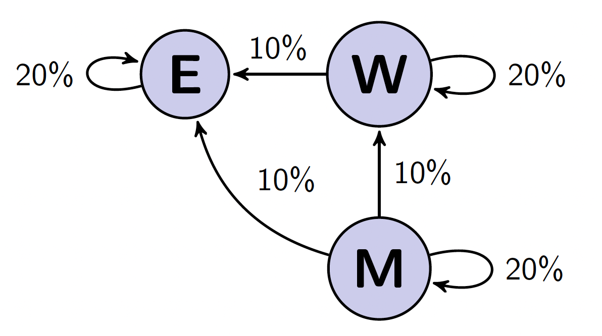
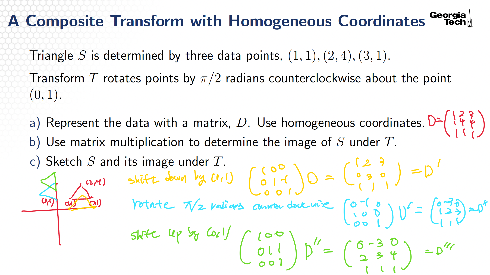
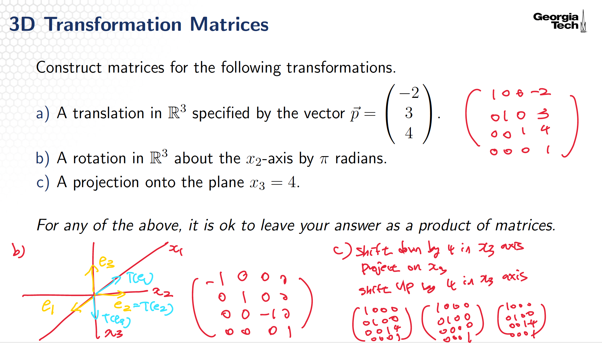

# Applications of Matrix Algebra
## Preliminaries
### Translation, Rotation and Scaling in Linear Algebra
- Translation: 위치 이동 ($ x \mapsto x + p$)
- Rotation: 방향 변화 ($x \mapsto Rx$)
- Scaling: 크기 변화$ x \mapsto Sx$ 

## Partioned Matrices and Matrix Multiplication
$$
A =
\begin{pmatrix}
3 & 1 & 4 & 1 & 0 \\
1 & 6 & 1 & 0 & 1 \\
0 & 0 & 0 & 4 & 2
\end{pmatrix}  =
\begin{pmatrix}
A_{1,1} & A_{1,2} \\
A_{2,1} & A_{2,2}
\end{pmatrix}
$$
We partitioned our matrix into four blocks, each of which has di erent
dimensions.
$$
A_{1,1} =
\begin{pmatrix}
3 & 1 & 4 \\
1 & 6 & 1
\end{pmatrix}, \quad
A_{1,2} =
\begin{pmatrix}
1 & 0 \\
0 & 1
\end{pmatrix} \quad
A_{2,1} =
\begin{pmatrix}
0 & 0 & 0
\end{pmatrix}, \quad
A_{2,2} =
\begin{pmatrix}
4 & 2
\end{pmatrix}
$$
Partitioned matrices can be multiplied using Row-Column method, as if each block
were a scalar.
$$
AB =
\begin{pmatrix}
1 & 0 & 1 \\
0 & 1 & 1
\end{pmatrix}
\begin{pmatrix}
2 & -1 \\
0 & -1 \\
0 & 1
\end{pmatrix}
=
\left( I_2 \;\; X \right)
\begin{pmatrix}
U \\
Y
\end{pmatrix} =I_2U + XY
$$

## Partitioned Matrices and the Matrix Inverse
We can use the Row Column Method to Construct an Inverse of partitioned matrices.  

Suppose $A \in \mathbb{R}^{n \times n}$, $B \in \mathbb{R}^{n \times n}$ and $C \in \mathbb{R}^{n \times n}$ are invertible matrices. 
Inverse matrix of partitioned matrix can be calcualted as below.
$$
\begin{pmatrix}
A & B \\
0 & C
\end{pmatrix}
\begin{pmatrix}
W & X \\
Y & Z
\end{pmatrix}
=
\begin{pmatrix}
I & 0 \\
0 & I
\end{pmatrix}
$$
Solve each element of left hand side matrix multiplication, 
$$
W = A^{-1}, \quad Z = C^{-1}, \quad Y = 0, \quad X = -A^{-1} B C^{-1}
$$
Therefore,
$$
\begin{pmatrix}
A & B \\
0 & C
\end{pmatrix}^{-1}
=
\begin{pmatrix}
A^{-1} & -A^{-1} B C^{-1} \\
0 & C^{-1}
\end{pmatrix}
$$

## Solving Linear Systems with the LU Factorization
A matrix factorization, or matrix decomposition is a factorization of a
matrix into a product of matrices. LU Factorization is a method to factor a matrix into lower and into upper triangular
matrices.

### Triangular Matrices
Rectangular matrix $A$ is upper triangular if $a_{i,j} = 0$ for $i > j$.
$$
\begin{pmatrix}
1 & 5 & 0 \\
0 & 2 & 4
\end{pmatrix},
\quad
\begin{pmatrix}
1 & 0 & 0 & 1 \\
0 & 2 & 1 & 0 \\
0 & 0 & 0 & 0 \\
0 & 0 & 0 & 1
\end{pmatrix},
\quad
\begin{pmatrix}
2 & 1 \\
0 & 1 \\
0 & 0 \\
0 & 0
\end{pmatrix}
$$
Rectangular matrix $A$ is lower triangular if $a_{i,j} = 0$ for $i < j$.
$$
\begin{pmatrix}
1 & 0 & 0 \\
3 & 2 & 0
\end{pmatrix},
\quad
\begin{pmatrix}
3 & 0 & 0 & 0 \\
1 & 1 & 0 & 0 \\
0 & 0 & 0 & 0 \\
0 & 2 & 0 & 1
\end{pmatrix},
\quad
\begin{pmatrix}
1 & 0 \\
1 & 4 \\
0 & 1 \\
2 & 0
\end{pmatrix}
$$
There are also matrices that both upper and lower triangular. Identity matrix and zero matrix.

Note that diagonal element of triangular matrix can be zero.

### LU Factorization
An LU factorization refers to expression of matrix $A$ into product of two factors, a lower triangular matrix $L$ and an upper triangular matrix $U$ such that $A = LU$.  
Note that if $A$ is an $m \times n$ matrix that can be row reduced to echelon form without row exchanges, then $A = LU$. Here, $L$ is a lower triangular $m \times m$ matrix with 1's on the diagonal, $U$ is an upper triangular matrix and also echelon form of $A$.

To compute the LU Factorization:
1. Reduce $A$ to an echelon form $U$ by a sequence of row replacement operations, if possible. 
2. Place entries in $L$ such that the same sequence of row operations reduces $L$ to $I$. (The same sequence of operations that reduce $A$ to $U$ will reduce $L$ to $I$.)

Note that "row replacement operations" are operations that are not row swapping operations but row replacement. (Replace a row with a multiple of a row above it to make upper triangular matrix. 윗행(i)을 이용해서 아랫행(j)을 바꾸는 방식만 사용!)
$$
\mathbf{R}_i \leftarrow \mathbf{R}_i + k \mathbf{R}_j (i \neq j)
$$

### Algorithm of using the LU Decomposition to Solve a Linear System
To solve $A \vec{x} = \vec{b}$ for $\vec{x}$:
1. Construct the LU decomposition of $A$ to obtain $L$ and $U$.
2. Set $U \vec{x} = \vec{y}$. Forward solve for $\vec{y}$ in $L \vec{y} = \vec{b}$.
3. Backwards solve for $\vec{x}$ in $U \vec{x} = \vec{y}$.

For example,
$$
A = LU =
\begin{pmatrix}
1 & 0 & 0 & 0 \\
1 & 1 & 0 & 0 \\
0 & 2 & 1 & 0 \\
0 & 0 & 1 & 1
\end{pmatrix}
\begin{pmatrix}
1 & 0 & 0 \\
0 & 2 & 1 \\
0 & 0 & 2 \\
0 & 0 & 0
\end{pmatrix}, \quad 
\vec{b} =
\begin{pmatrix}
2 \\
3 \\
2 \\
0
\end{pmatrix}
$$

First, set $U \vec{x} = y$ and solve $L \vec{y} = \vec{b}$.
$$
\begin{pmatrix}
1 & 0 & 0 & 0 \\
1 & 1 & 0 & 0 \\
0 & 2 & 1 & 0 \\
0 & 0 & 1 & 1
\end{pmatrix}
\begin{pmatrix}
y_1 \\
y_2 \\
y_3 \\
y_4
\end{pmatrix}
=
\begin{pmatrix}
2 \\
3 \\
2 \\
0
\end{pmatrix}, \quad
\vec{y} =
\begin{pmatrix}
2 \\
1 \\
0 \\
0
\end{pmatrix},
$$
Then, solve $U \vec{x} = y$.
$$
\begin{pmatrix}
1 & 0 & 0 \\
0 & 2 & 1 \\
0 & 0 & 2 \\
0 & 0 & 0
\end{pmatrix}
\begin{pmatrix}
x_1 \\
x_2 \\
x_3
\end{pmatrix}
=
\begin{pmatrix}
2 \\
1 \\
0 \\
0
\end{pmatrix}, \quad 
\vec{x} =
\begin{pmatrix}
2 \\
\frac{1}{2} \\
0
\end{pmatrix}
$$

### The Leontif Input-Output Model
The consumption matrix, $C$, describes how units are consumed by sectors to produce output.
Two equivalent ways of de ning entries of $C$.
- sector $i$ sends a proportion of its units to sector $j$, call it $c_{i,j} x_i$.
- sector $j$ requires a proportion of the units created by sector $i$, call it $c_{i,j} x_i$.
Entries of $C$ are $c_{i,j}$ , with $c_{i,j} \in [, 1]$, and
- $C \vec{x}$: units consumed.
- $\vec{x} - C \vec{x}$: units left after internal consumption.

    

$$
\text{Units Consumed} = C \vec{x}
= x_E \begin{pmatrix} 0.2 \\ 0.1 \\ 0.1 \end{pmatrix}
+ x_W \begin{pmatrix} 0 \\ 0.2 \\ 0.1 \end{pmatrix}
+ x_M \begin{pmatrix} 0 \\ 0 \\ 0.2 \end{pmatrix}
= \begin{pmatrix}
0.2 & 0 & 0 \\
0.1 & 0.3 & 0 \\
0.1 & 0.1 & 0.2
\end{pmatrix}
\vec{x}
$$

## Homogeneous Coordinates
Homogeneous coordinates are used to model translations using
matrix multiplication.

Each point $(x,y) \in \mathbb{R}^{2}$ can be identified with the point $(x,y,H), \quad H \neq 0$ on the plane in $\mathbb{R}^{3}$ that lies $H$ units above the $xy$-plane.  
Also note that often $H=1$ set.

### Why Homogenous Coordinates are needed
We introduced rotations about the origin, but not about arbitrary points. How can we represent translations, and rotations about arbitrary points, using linear transforms? Also, we also did not explore the transform $(x,y) \rightarrow (x + h, y + k)$.

A translation of the form  $(x,y) \rightarrow (x + h, y + k)$ can be represented as a matrix multiplication with homogeneous coordinates.

### Homogeneous Coordinates Example 1
The translation of the form $(x,y) \rightarrow (x + h, y + k)$ can be represented as a matrix multiplication with homogeneous coordinates.
$$
\begin{pmatrix}
1 & 0 & h \\
0 & 1 & k \\
0 & 0 & 1
\end{pmatrix}
\begin{pmatrix}
x \\
y \\
1
\end{pmatrix}
=
\begin{pmatrix}
x + h \\
y + k \\
1
\end{pmatrix}
$$

### Homogeneous Coordinates Example 2: A Composite Transform with Homogeneous Coordinates
    

### 3D Transformations of Homogenious Coordinates
Homogeneous coordinates in 3D are analogous to our 2D coordinates.
$(X,Y,Z,1)$ are homogeneous coordinates for $(x,y,z)$ in $\mathbb{R}^3$.

#### Homogeneous Coordinates 3D Example 1
A translation of the form $(x,y,z) \rightarrow (x + h, y + k,z + l)$ can be represented as a matrix multiplication with homogeneous coordinates.
$$
\begin{pmatrix}
1 & 0 & 0 & h \\
0 & 1 & 0 & k \\
0 & 0 & 1 & l \\
0 & 0 & 0 & 1
\end{pmatrix}
\begin{pmatrix}
x \\
y \\
z \\
1
\end{pmatrix}
=
\begin{pmatrix}
x + h \\
y + k \\
z + l \\
1
\end{pmatrix}
$$

#### Homogeneous Coordinates 3D Example 2
    

#### Few more things about homogeneous coordinates
$$
\begin{pmatrix}
I & p \\
0 & 1
\end{pmatrix}
\begin{pmatrix}
x \\
1
\end{pmatrix}
=
\begin{pmatrix}
x + p \\
1
\end{pmatrix}
$$
- Identity matrix가 사용되는 이유: 기존 좌표 유지를 위해.즉, $I$로 원래 좌표 유지하고 $p$ 덧셈 연산(translation) 추가.
- 마지막 행 $(0 \cdots 1)$인 이유: homogeneous coordinates((x+p,1)의 1)를 1로 유지하기 위해.
- 벡터를 “마지막 열”에 놓는 이유: $Ix + p1$ 연산을 위해서.

결론적으로 homogenous coordinates는 arbitrary point 대한 rotation과 translation 을 선형변환 (matrix multiplication) 으로 표현 할 수 있는 트릭입니다.
