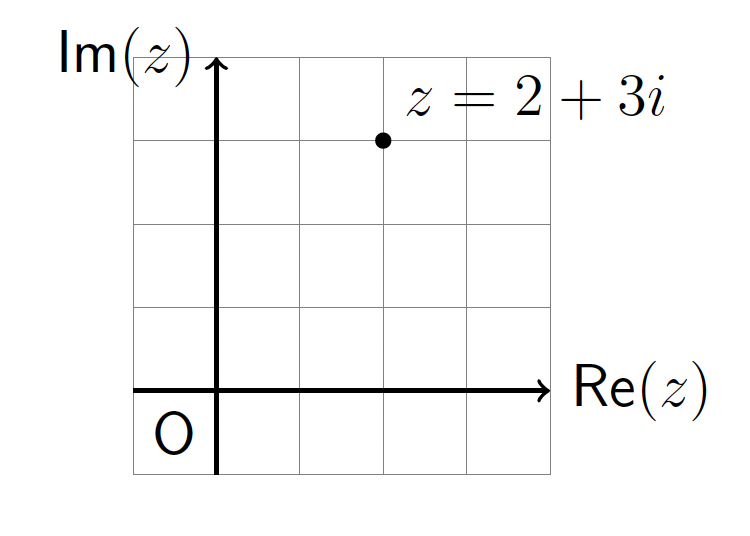

# Diagonalization and Page Rank
## Diagonalization
#### Diagonal Matrices
A matrix is diagonal if the only non-zero elements, if any, are on the main
diagonal. It is easy to compute the powers of diagonal matrices.
$$
A = \begin{pmatrix} 3 & 0 \\ 0 & 5 \end{pmatrix} \quad
A^2 = \begin{pmatrix} 3 & 0 \\ 0 & 5 \end{pmatrix} \quad
\begin{pmatrix} 3 & 0 \\ 0 & 5 \end{pmatrix} \quad
= \begin{pmatrix} 3^2 & 0 \\ 0 & 5^2 \end{pmatrix} \\[5pt]
A^k = \begin{pmatrix} 3^k & 0 \\ 0 & 5^k \end{pmatrix}
$$
### Diagonalization
Suppose $ A \in R^{n \times n}$, we say that matrix $A$ is diagonalizable if it is similar to
a diagonal matrix, $D$. That is, we can write $A = PDP^{-1}$.

Note that $\vec{v}$ are linearly independent eigenvectors, and $\lambda$ are the
corresponding eigenvalues.
$$
A = PDP^{-1} = (\vec{v}_1\ \vec{v}_2\ \cdots\ \vec{v}_n)
\begin{pmatrix}
\lambda_1 & 0 & \cdots & 0 \\
0 & \lambda_2 & \cdots & 0 \\
\vdots & \vdots & \ddots & \vdots \\
0 & 0 & \cdots & \lambda_n
\end{pmatrix}
(\vec{v}_1\ \vec{v}_2\ \cdots\ \vec{v}_n)^{-1}
$$

If matrix $A$ is diagonalizable , $A$ has $n$ linearly independent eigenvectors.

### How To Determine Whether a Matrix is Diagonalizable
If an $n \times n$ matrix has $n$ distinct eigenvalues then the matrix will be diagonalizable.
- $D$ is constructed from the $n$ eigenvalues of $A$. We can always construct $D$.
- $P$ must be $n \times n$ and invertible. In other words, the eigenvectors of $A$ must form a basis for $R^n$.

Therefore, the question of whether we can diagonalize a matrix comes down to whether
or not we can construct an $n \times n$ invertible $P$.

The following statements are equivalent.
- The sum of all the geometric multiplicities is $n$.
- Algebraic multiplicity = geometric multiplicity
- $A$ is diagonalizable.
- The eigenvectors of $A$ form a basis for $R^n$.

Also note that the invertibility of a matrix does not tell us anything about whether the
matrix is diagonalizable.

## Complex Eigenvalues
### Review of Complex Numbers
The imaginary (or complex) numbers are denoted by $\mathbb{C}$, where
$\mathbb{C} = \{a + bi \mid a, b \in \mathbb{R} \}$. The number $z = a + bi$ may be associated with the point $(a, b) \in R^2$.

For example, the number $z = 2 + 3i$ is indicated in the sketch below.
   
Note that  $Re(z$)$ as the real part of complex number $z$, and $Im(z)$ as the
imaginary part of $z$.

#### Complex Conjugate, Absolute Value, Polar Form
- The conjugate complex numbers: $a + bi = a - bi$.
- The absolute value of a complex number: $a + bi = \sqrt{a^2 + b^2}$.
- The polar form: $a + bi = r(cos \phi+ sin \phi  i)$, where, $r = \mid a + bi \mid,  tan \phi = \frac{b}{a}$.

<b> Polar Form </b>  
복소수를 “길이 + 각도”로 표현하는 방식입니다. 
- $r$ (magnitude): 원점에서 점 $(a,b)$까지의 거리 ($\sqrt{a^2 + b^2}$).
- $\phi$ (각도): 복소평면에서 $x$축과 이루는 각.

$$
a = r cos \phi, b = r sin \phi \\
a+bi = r cos \phi +(r sin \phi)i = r(cos \phi + sin \phi i)
$$ 

#### Complex Conjugate Properties
If $x$ and $y$ are complex numbers, $\vec{v} \in \mathbb{C}^n$, it can be shown that,
- $\overline{x+y} = \overline{x} + \overline{y}$
- $\overline{A\vec{v}} = A\,\overline{\vec{v}}$
- $\operatorname{Im}(x\overline{x}) = 0$

### Complex Roots of the Characteristic Polynomial
Every polynomial of degree n has exactly n complex roots, counting multiplicity. n차 다항식은 복소수 범위에서 항상 정확히 n개의 해를 가진다.  
If $\lambda \in \mathbb{C}$ is a root of a real polynomial $p(x)$, then the conjugate $\overline{\lambda}$ is also a root of $p(x)$.

### Rotation Dilation Matrices
A matrix of the form $C = \begin{pmatrix}
a & -b \\
b & a
\end{pmatrix}$ is a rotation-dilation matrix
because it is the composition of a rotation by $\phi$ and dilation by $r$.  
Note that,
$$
\tan \phi = \frac{b}{a}, \quad \tan \phi = \frac{b}{a}
$$
Moreover, the eigenvalues of C are $\lambda = a \pm bi$.

### The PCP^{-1} Decomposition
If $A$ is a real $2 \times 2$ matrix with eigenvalue $\lambda = a - bi \quad (b \neq 0)$ and associated eigenvector $\vec{v}$, then we may construct the decomposition.
$$
A = PCP^{-1} \\[5pt]
P = (\operatorname{Re}\vec{v} \;\; \operatorname{Im}\vec{v}), \quad C = \begin{pmatrix}
a & -b \\
b & a
\end{pmatrix}
$$
(a,b)는 eigenvalue의 실수/허수 부분 이고 $\vec{v}$는 eigenvector 이다.  
Also note that C is referred to as a rotation dilation matrix, because it is the composition of a rotation by $\phi$  and dilation by $r$.  

The $A = PCP^{-1}$ decomposition allows us to compute large powers of $A$
eficiently.

## Google Page Rank
### Long-Term Behavior of Markov Chains
Markov matrix는 언제나 $P \vec{q} = \vec{q}$ 식을 만족하므로, $\lambda = 1$ 인 eigenvalue가 존재한다.
따라서, 시간이 지나도 변하지 않는 상태 steady-state $\vec{v}$는 아래 해로 구할 수 있다.
$$
(P - I) \vec{q} = \vec{0}
$$

### PageRank
PageRank (PR) is an algorithm used by Google Search to rank websites in their search engine results.
The PageRank is the ranking assigned to each page based on its
importance. The highest ranked page has PageRank 1, the second
PageRank 2, and so on. Two pages with same importance receive the same PageRank (some other method would be needed to resolve ties).

### Computing PageRank
